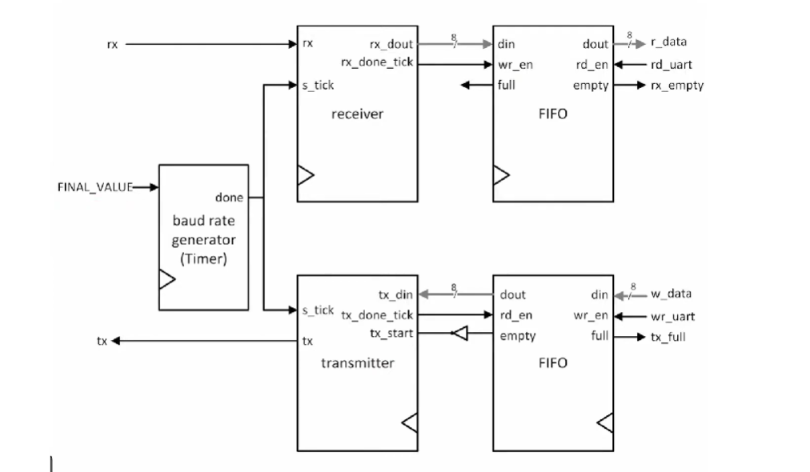

# UART-Protocol-Design On FPGA 
A complete, synthesizable UART **(Universal Asynchronous Receiver/Transmitter)** terminal implemented in Verilog for FPGA development. This system provides asynchronous serial communication at **9600 bps**, robust hardware button debouncing with metastability protection, synchronous FIFO buffering for lossless data handling, and a real-time multiplexed hexadecimal display on an 8-digit 7-segment interface.

**Universal Asynchronous Receiver/Transmitter (UART)** is one of the oldest and most widely used serial communication protocols in embedded systems and digital hardware design. Unlike synchronous protocols such as SPI or I2C, UART requires no shared clock line between sender and receiver — instead, both sides agree on a baud rate in advance and use it independently to time their bit sampling.
The word *asynchronous* is the key: the transmitter and receiver each run from their own local clock. They only stay in sync for the duration of a single frame, re-synchronizing on every start bit.

## Features
- **Full UART RX/TX Engine**: 8-bit data, LSB-first, 1 stop bit (16x oversampling)
- **Baud Rate Generation**: Configurable timer-based baud strobe (default: 9600 bps @ 100 MHz)
- **Synchronous FIFO Buffering**: Dual Xilinx `fifo_generator_0` cores for RX & TX paths
- **Robust Button Pipeline**: 2-stage sync → 20ms debounce FSM → edge detection
- **Real-Time 7-Seg Display**: ~960 Hz multiplexed scan, hex decoding, valid-data DP indicator
- **Status Monitoring**: `rx_empty` and `tx_full` LEDs for buffer state visibility

## Top Level Block


### Default Parameters
| Parameter | Value | Description |
|-----------|-------|-------------|
| `CLK_FREQ` | 100 MHz | System clock (Basys3/Nexys4 default) |
| `BAUD_RATE` | 9600 bps | UART baud rate |
| `BAUD_LIMIT` | 650 | `(100_000_000 / 9600 / 16) - 1` |
| `DEBOUNCE_TIME` | ~20 ms | `1_999_999` cycles @ 100 MHz |
| `SCAN_FREQ` | ~960 Hz | `104_165` cycles @ 100 MHz |


## Top-Level Port Mapping
```verilog
input        clk, rst_n          // 100 MHz clock, active-low reset
input        rd_btn, wr_btn      // Noisy pushbuttons
input        rx                  // UART receive line
input  [7:0] sw                  // Switches: byte to transmit
output       tx                  // UART transmit line
output       rx_empty, tx_full   // FIFO status LEDs
output [6:0] seg7                // 7-segment cathode outputs (gfedcba)
output [0:7] AN                  // 8-digit anode selector (active-low)
output       DP                  // Decimal point (active-low)
```


**Data Flow:**
1. **TX Path**: `SW[7:0]` → `wr_pedge` → TX FIFO → `serial_tx` → `tx` pin
2. **RX Path**: `rx` pin → `serial_rx` → RX FIFO → `rd_pedge` → `seg7_controller`
3. **Timing**: `var_timer` generates 16x baud tick → drives both UART state machines

## Module Reference
| File | Description |
|------|-------------|
| `uart_terminal.v` | Top-level design. Routes buttons, switches, UART I/O, LEDs, and display. |
| `uart_core.v` | Central UART engine. Instantiates RX/TX FSMs, baud timer, and dual FIFOs. |
| `serial_rx.v` | UART receiver FSM. Detects start bit, samples at mid-bit, shifts LSB-first, asserts `rx_done`. |
| `serial_tx.v` | UART transmitter FSM. Sends start/data/stop bits, asserts `tx_done` on frame completion. |
| `var_timer.v` | Parameterized up-counter to `LIMIT`. Generates `done` tick for 16x baud timing. |
| `btn_input.v` | Button conditioning pipeline: `clk_sync` → `glitch_filter` → `transition_detect`. |
| `clk_sync.v` | 2-stage synchronizer for metastability protection on async inputs. |
| `glitch_filter.v` | Debounce wrapper. Uses 20ms `countdown_timer` + FSM controller. |
| `glitch_filter_ctrl.v` | 4-state Moore FSM that commits state changes only after timer settlement. |
| `transition_detect.v` | 4-state Moore FSM generating single-cycle `rise`, `fall`, and `any_edge` pulses. |
| `seg7_controller.v` | Multiplexed 7-seg driver. ~960 Hz refresh, handles 8 anodes, per-digit DP. |
| `nibble_to_seg7.v` | Hex 4-bit to 7-segment decoder (`1 = segment OFF`). |
| `mux8_wide.v` | Parameterized 8-to-1 multiplexer for display slot routing. |
| `bin_to_onehot.v` | Binary-to-one-hot decoder for active-low anode selection. |
| `flex_counter.v` | Up/down counter with parallel load. Drives digit scan index. |
| `countdown_timer.v` | Counts to `MAX_COUNT`, wraps to `0`, outputs `done` pulse. Used for scan & debounce timing. |


### Baud-Rate Generator
`var_timer` with `BITS=11` counts from 0 to `BAUD_LIMIT`, producing a one-cycle `baud_tick` pulse — the 16× oversample strobe used by both datapaths.

### Receive Path

1. `serial_rx` monitors `rx` for a falling start-bit edge.
2. On frame completion, `rx_done` fires for one cycle.
3. `rx_done` drives `RX_FIFO.wr_en` — the recovered byte is enqueued.
4. External logic reads bytes by asserting `rd_req`.

### Transmit Path

1. External logic enqueues a byte by asserting `wr_req` with `w_data`.
2. `serial_tx` detects the non-empty FIFO (`~tx_fifo_empty`) and begins transmitting.
3. On frame completion `tx_done` fires, driving `TX_FIFO.rd_en` to fetch the next byte.

## FIFO Details

Both FIFOs are instances of the Xilinx `fifo_generator_0` IP:

|Property|Value|
|---|---|
|Width|8 bits (DBIT)|
|Depth|Configured in Vivado IP|
|Reset|Synchronous active-high (`srst = ~rst_n`)|
|Interface|Standard (wr_en, rd_en, din, dout, full, empty)|


